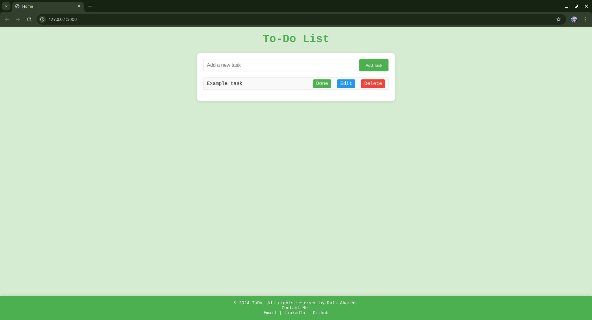

# To-Do List App

This is a simple and stylish **To-Do List** web application built using **Flask**, HTML/CSS, and JavaScript. It allows users to add, edit, mark as completed, and delete tasks in a user-friendly interface.

## Features

- **Add Tasks**: Users can add tasks with ease through a simple form.
- **Edit Tasks**: Existing tasks can be edited.
- **Mark as Completed**: Tasks can be marked as done, with a strikethrough style indicating completion.
- **Delete Tasks**: Unwanted tasks can be deleted.
- **Responsive Design**: Works well on both desktop and mobile devices.

## Demo



## Installation

1. **Clone the repository**:
    ```bash
    git clone https://github.com/RafiAhamed07/sword_Todo.git
    cd sword_Todo
    ```

2. **Set up a virtual environment** (optional but recommended):
    ```bash
    python -m venv venv
    source venv/bin/activate # On Windows: venv\Scripts\activate
    ```

3. **Install dependencies**:
    ```bash
    pip install -r requirements.txt
    ```

4. **Run the Flask app**:
    ```bash
    cd Todo
    flask run
    ```
   The app will be available at `http://127.0.0.1:5000/`.

## Usage

- **Homepage**: Displays the current list of tasks. Users can add new tasks, mark them as completed, edit, or delete them.

## Project Structure

📂 Todo<br>
├── 📂 static<br>
│ ├── 📄 style.css<br>
├── 📂 templates<br>
│ ├── 📄 base.html<br>
│ ├── 📄 index.html<br>
│ ├── 📄 update.html<br>
├── 📄 app.py # Flask application<br>
├── 📄 requirements.txt # Python dependencies<br>
└── 📄 README.md<br>


## Technologies Used

- **Flask**: A lightweight Python web framework.
- **Jinja2**: For HTML templating.
- **HTML5/CSS3**: Frontend structure and styling.
- **JavaScript**: For dynamic elements.
- **SQLite**: For task storage (optional if using a database).

## Contributing

Contributions are welcome! Please follow these steps:

1. Fork the project.
2. Create a new branch (`git checkout -b feature/new-feature`).
3. Commit your changes (`git commit -m 'Add some feature'`).
4. Push to the branch (`git push origin feature/new-feature`).
5. Open a pull request.

## License

This project is licensed under the MIT License. See the `LICENSE` file for details.

## Contact

Created by [Rafi Ahamed](https://rafiahamed.netlify.app) – feel free to reach out!
